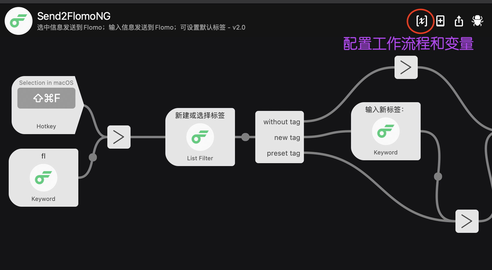
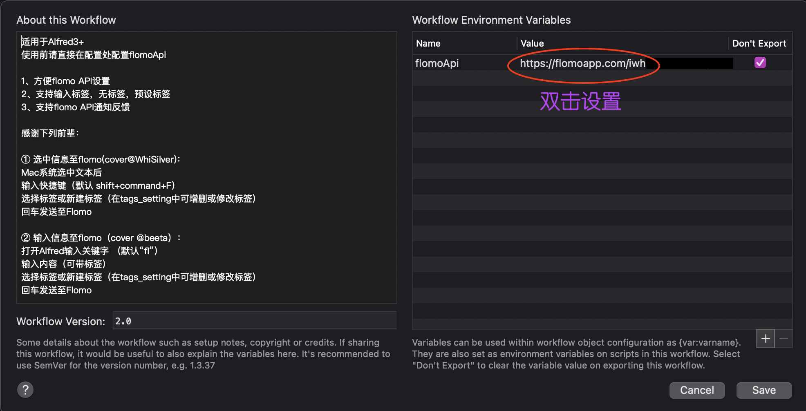

# Send2FlomoNG-Alfred-workflow
Flomo + Alfred: select text or type in and  send it to flomo

With full tags edition

---

注意：

该workflow改编自@WhiSilver（见fork）

感谢原开发者@beeta（见workflow：Alfred2Flomo）

适用于Alfred3+ 
使用前请直接在配置处配置flomoApi

Send2Flomo在前辈基础上优化几处：

1. 方便flomo API设置
2. 支持输入标签，无标签，预设标签
3. 支持flomo API通知反馈

# 安装说明

1. 下载workflow文件，双击打开

2. Alfred preference 中进入workflow，点击右上角[X]，配置flomo api 
   

   
   API查询：[Flomo API](https://flomoapp.com/mine?source=incoming_webhook)

# 使用说明
以原作者WhiSilver的Send2Flomo演示。

## 用法一：
任意处选中文本发送

https://user-images.githubusercontent.com/23276566/116066076-3e0b7c00-a6ba-11eb-8d7f-4ce1546707b1.mov

## 用法二：
在Alfred输入memo

https://user-images.githubusercontent.com/23276566/116066103-45328a00-a6ba-11eb-84a3-57f5fefcbbfb.mov

